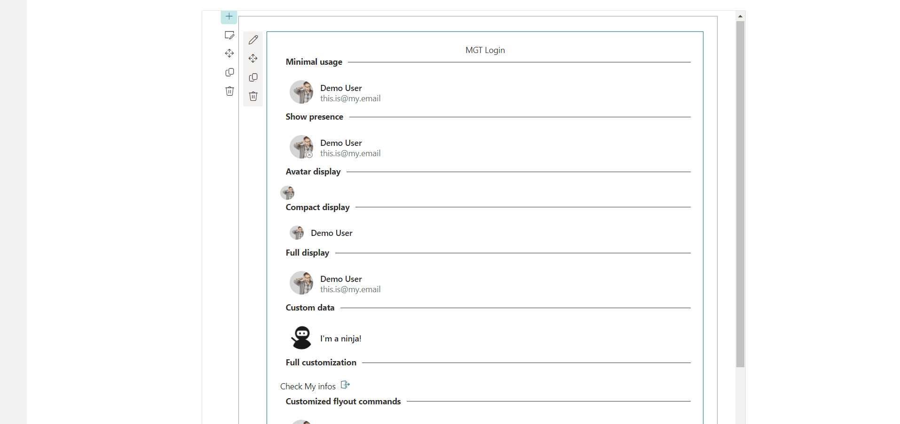

# mgt-login-spfx

## Summary

This sample illustrates how to use the `Login` component from the Microsoft Graph Toolkit React package in a SharePoint Framework web part.

## Used SharePoint Framework Version

## Contributors

Guido Zambarda ([@iamguidozam](https://x.com/iamguidozam)), PiaSys.com

## Version history

| Version | Date             | Comments        |
| ------- | ---------------- | --------------- |
| 1.0     | June 22, 2024 | Initial release |

## Disclaimer

**THIS CODE IS PROVIDED _AS IS_ WITHOUT WARRANTY OF ANY KIND, EITHER EXPRESS OR IMPLIED, INCLUDING ANY IMPLIED WARRANTIES OF FITNESS FOR A PARTICULAR PURPOSE, MERCHANTABILITY, OR NON-INFRINGEMENT.**

---

## Minimal Path to Awesome

- Clone this repository
- Ensure that you are at the solution folder
- in the command-line run:
  - **npm install**
  - **gulp serve**

## Features

This sample illustrates the following concepts on top of the SharePoint Framework:

- Using the `Login` component from the Microsoft Graph Toolkit.
- Using the Microsoft Graph Toolkit in a SharePoint Framework web part.

## References

- [Getting started with SharePoint Framework](https://docs.microsoft.com/en-us/sharepoint/dev/spfx/set-up-your-developer-tenant)
- [Use Microsoft Graph in your solution](https://docs.microsoft.com/en-us/sharepoint/dev/spfx/web-parts/get-started/using-microsoft-graph-apis)
- [Microsoft Graph Toolkit with React](https://learn.microsoft.com/en-us/graph/toolkit/get-started/mgt-react)
- [Microsoft 365 Patterns and Practices](https://aka.ms/m365pnp) - Guidance, tooling, samples and open-source controls for your Microsoft 365 development

