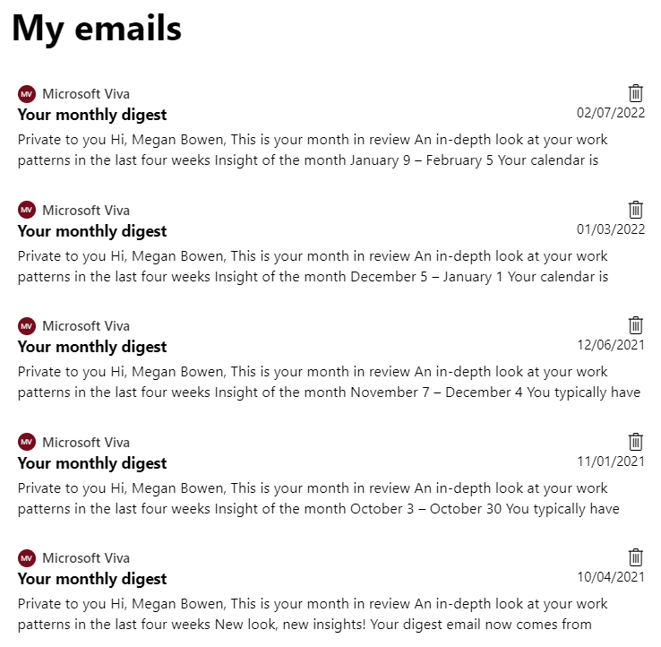

# Using emails in a `mgt-get` template

## Summary

This sample demonstrates the usage of the `mgt-get` component connected to the email data from Microsoft Graph. It also illustrates the use of custom functions to format and act on the received data.

## Compatibility

## Applies to

* [Microsoft Graph Toolkit](https://docs.microsoft.com/graph/toolkit/overview)
* [Microsoft Graph](https://docs.microsoft.com/graph/)

> Get your own free development tenant by subscribing to [Microsoft 365 developer program](http://aka.ms/o365devprogram)

## Solution

Solution|Author(s)
--------|---------
mgt-get-emails | [Sébastien Levert](https://github.com/sebastienlevert) ([@sebastienlevert](https://twitter.com/sebastienlevert)), Company

## Version history

Version|Date|Comments
-------|----|--------
1.0|February 25, 2022|Initial release

## Features

This sample illustrates the following concepts on top of the Microsoft Graph Toolkit:

* Including external styles
* Including external scripts
* Adding JavaScript function to the template context

<!--
RESERVED FOR REPO MAINTAINERS

We'll add the video from the community call recording here

## Video

-->

## Help

We do not support samples, but this community is always willing to help, and we want to improve these samples. We use GitHub to track issues, which makes it easy for  community members to volunteer their time and help resolve issues.

You can try looking at [issues related to this sample](https://github.com/pnp/mgt-samples/issues?q=label%3A%22sample%3A%20mgt-get-emails%22) to see if anybody else is having the same issues.

You can also try looking at [discussions related to this sample](https://github.com/pnp/mgt-samples/discussions?discussions_q=mgt-get-emails) and see what the community is saying.

If you encounter any issues while using this sample, [create a new issue](https://github.com/pnp/mgt-samples/issues/new?assignees=&labels=Needs%3A+Triage+%3Amag%3A%2Ctype%3Abug-suspected%2Csample%3A%20mgt-get-emails&template=bug-report.yml&sample=mgt-get-emails&authors=@sebastienlevert&title=mgt-get-emails%20-%20).

For questions regarding this sample, [create a new question](https://github.com/pnp/mgt-samples/issues/new?assignees=&labels=Needs%3A+Triage+%3Amag%3A%2Ctype%3Aquestion%2Csample%3A%20mgt-get-emails&template=question.yml&sample=mgt-get-emails&authors=@YOURGITHUBUSERNAME&title=mgt-get-emails%20-%20).

Finally, if you have an idea for improvement, [make a suggestion](https://github.com/pnp/mgt-samples/issues/new?assignees=&labels=Needs%3A+Triage+%3Amag%3A%2Ctype%3Aenhancement%2Csample%3A%20mgt-get-emails&template=suggestion.yml&sample=mgt-get-emails&authors=@sebastienlevert&title=mgt-get-emails%20-%20).

## Disclaimer

**THIS CODE IS PROVIDED *AS IS* WITHOUT WARRANTY OF ANY KIND, EITHER EXPRESS OR IMPLIED, INCLUDING ANY IMPLIED WARRANTIES OF FITNESS FOR A PARTICULAR PURPOSE, MERCHANTABILITY, OR NON-INFRINGEMENT.**

